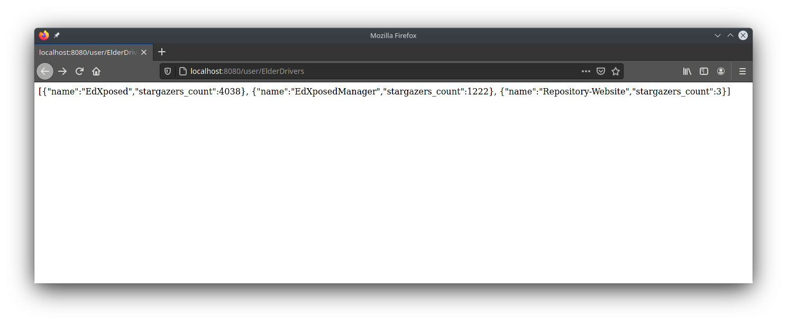
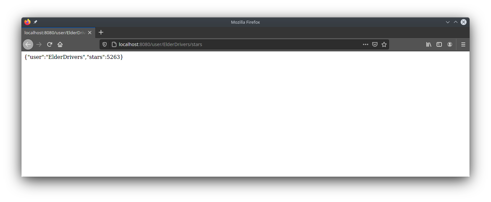

# Github Repositories Viewer
Aplikacja serwerowa zwracająca podstawowe informacje na temat repozytoriów oraz użytkowników GitHuba.

## Tabela zawartości
* [Informacje](#informacje)
* [Zrzuty ekranu](#zrzuty-ekranu)
* [Technologie](#technologie)
* [Uruchomienie](#uruchomienie)
* [Funkcje](#funkcje)


## Informacje
Aplikacja została stworzona jako zadanie rekrutacyjne na staż do Allegro

## Zrzuty ekranu
#### Pobranie listy repozytoriów użytkownika ElderDrivers

#### Pobranie sumy gwiazdek repozytoriów użytkownika ElderDrivers


## Technologie
* Java
* Spring

## Uruchomienie
1. Pobierz plik .jar
2. Uruchom plik .jar używając Javy
```
 java -jar "githubrepoviewer-0.0.1-SNAPSHOT.jar"
```
3. In your browser:  
    * Aby otrzymać listę repozytoriów wraz z gwiazdkami dane użytkownika wpisz:
    ```
    http://localhost:8080/user/{nazwa_uzytkownika}
    ```
    * Aby otrzymać sumę gwiazdek z wszystkich repozytoriów użytkownika wpisz:
    ```
    http://localhost:8080/user/{nazwa_uzytkownika}/stars
    ```

## Funkcje
### Zrealizowane
* Zwracanie listy repozytoriów danego użytkownika
* Zwracanie sumy gwiazdek repozytoriów danego użytkownika

### Pomysły na rozszerzenie aplikacji
* Zwracanie większej ilości szczegółów na temat repozytoriów, np. ilość forków, język, datę stworzenia, aktualizacji itp.
* Zwracanie statystyk dotyczących danego użytkownika, np. suma ilości commitów, najpopularniejszy język, ilość obesrwatorów itp.